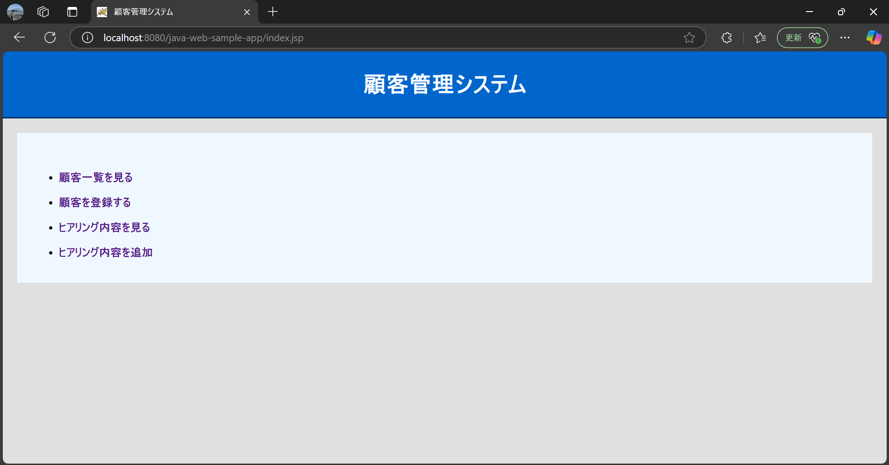
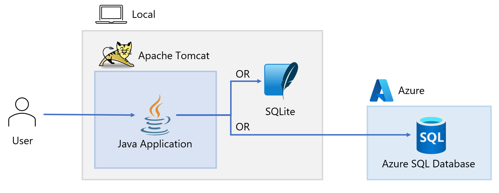

# java-web-sample-app-tomcat
本リポジトリは、Tomcat をアプリケーションサーバーとして利用して動かす Java Web アプリケーションのサンプルコードです。起動すると以下のような簡易的な顧客管理システムが利用できます。



また、本サンプルアプリは [Azure Migrate: App Containerization Tool](https://learn.microsoft.com/ja-jp/azure/migrate/tutorial-app-containerization-java-app-service) の検証としても利用可能なサンプルになります。Azure Migrate: App Containerization Tool の検証を行いたい場合、[こちらのドキュメント](docs/Azure-Migrate.md) を参照してください。

## アーキテクチャ
本サンプルアプリのアーキテクチャは以下になります。データベースは SQLite か Azure SQL Database を選択可能です。


## 想定環境
本リポジトリは以下の環境で動作することを確認済みです。
- OS: Ubuntu (WSL2)
- Shell: Bash

## 事前準備
本サンプルアプリケーションを利用するためには、以下のランタイムやドライバーが必要です。
- Apache Tomcat (バージョン 9)
- Java SE Development Kit (バージョン 8)
- Microsoft JDBC ドライバー (Java バージョン 8 用)
- SQL JDBC ドライバー

downloaded ディレクトリ配下に上記のランタイムやドライバーを保存しています(※)。他のバージョンを利用したい場合は、[こちらの手順](docs/Setup.md) を参考にしてダウンロード等の準備を行ってください。ただし、他のバージョンで正常にサンプルアプリが動作するかどうかは未検証です。

> (※) 厳密には jdk-8u421-linux-x64.tar のみ軽量化のために一部ファイルを削除したファイルに代えています。JavaFX の WebView コンポーネントであり、Web コンテンツを表示するためのネイティブライブラリの libjfxwebkit.so は 100 MB を超える巨大ファイルです。しかし、このライブラリは JSP/サーブレットを使用した本サンプルアプリ Web アプリケーションの起動には直接関係がないため、downloded/jdk-8u421-linux-x64.tar のファイルから libjfxwebkit.so を削除しています。

## サンプルアプリの起動手順
### Java Web アプリのビルド
以下のコマンドを実行して、build.sh のシェルスクリプトを実行して下さい。
```
./java-web-sample-app/build.sh 
```

### Apache Tomcat の起動
以下のコマンドを実行し、Tomcat を実行してください。`Tomcat started.` とターミナルに出力されていれば正しく実行されています。
```
apache-tomcat-9.0.98/bin/startup.sh
```

(任意) Tomcat を停止したい場合は、以下のコマンドを実行してください。
```
apache-tomcat-9.0.98/bin/shutdown.sh
```

また、Tomcat をフォアグラウンドで実行してログを出力したい場合などは、以下のコマンドを startup.sh の代わりに実行して下さい。
```
apache-tomcat-9.0.98/bin/catalina.sh run
```

Tomcat を実行した後、ブラウザで以下の URL にアクセスすることでサンプルアプリのフロント画面が表示されます。
```
http://localhost:8080/java-web-sample-app/index.jsp
```

### Apache Tomcat の起動状況の確認
サンプルアプリが正常に起動しない場合は、Tomcat Web アプリケーションマネージャを利用することで、アプリケーションの起動状況を把握することが可能です。Apache Tomcat を起動した後、ブラウザで以下の URL にアクセスすることでアプリケーションマネージャにアクセス可能です。
```
http://localhost:8080/manager/html
```

## Azure SQL Database への切り替え
このサンプルアプリでは、SQLite と Azure SQL Database を利用できます。
java-web-sample-app/src/resources/database.properties の `db.type` を以下のように変更することで切り替えが可能です。
- SQLite を利用する場合：sqlite
- Azure SQL Database を利用する場合：azure

Azure SQL Database が未作成の場合は、以下の手順に従って下さい。

### Azure SQL Database の作成
Azure ポータルから、Azure SQL Database を作成します。
Azure SQL Database の作成に合わせて、必要に応じて SQL Database サーバーの作成も行ってください。
SQL Database サーバーの作成時、認証方法は「SQL 認証を使用する」を選択して下さい。
また、ネットワークタブではパブリックネットワークアクセスを許可し、自身のクライアント IPv4 アドレスをファイアーウォール規則に登録してください。

## database.properties ファイルの変更
Azure SQL Database 作成後は以下の手順に従って、java-web-sample-app/src/resources/database.properties 内の Azure SQL Database 用設定を変更して下さい。

#### azure.jdbc.url の変更
Azure ポータルで、作成済みの Azure SQL Database の画面を開き、設定 > 接続文字列 > JDBC > JDBC (SQL 認証) から接続文字列をコピーし、`{your_password_here}` を設定済みパスワードに変更して database.properties ファイルを設定

#### azure.jdbc.driver
com.microsoft.sqlserver.jdbc.SQLServerDriver が登録済みドライバーなので、これをそのまま設定してください。[参考ドキュメント](https://learn.microsoft.com/ja-jp/sql/connect/jdbc/using-the-jdbc-driver?view=sql-server-ver16)

#### azure.db.user
ユーザー名は以下の形式で設定して下さい。
```
azure.db.user=<your-username>@<your-server-name>
```
ただし、<your-username> には、Azure SQL Database 作成時に入力したサーバー管理者ログインを設定し、
<your-server-name> には、Azure SQL Database 作成時入力したサーバー名を設定して下さい。
サーバー名は以下の形式となっていますが、そのうちの <your-server-name> をサーバー名として使用します。
```
<your-server-name>.database.windows.net
```

#### azure.db.pass
Azure SQL Database 作成時に入力したパスワードを設定して下さい。
